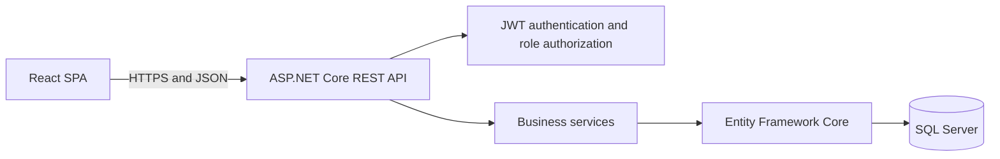

# Shop and Warehouse Management System

An engineering thesis project that combines point-of-sale operations, warehouse management, reporting, and store events in one web application.

The system supports the daily work of a stationary shop with its own warehouse. Sales and returns update inventory data, incoming and outgoing shipments follow operational workflows, and employees receive access according to their assigned roles.

> **Project status:** completed academic prototype developed as an engineering thesis at Bialystok University of Technology in 2026. It is not intended for production use without additional security, deployment, and operational hardening.

## Main capabilities

- Point of sale with receipts, invoices, payments, returns, and gift cards
- Product catalogue with categories, tax rates, barcodes, and activation status
- Warehouse structure with stock levels, locations, transfers, and inventory changes
- Incoming and outgoing shipment workflows, including collection and preparation
- Sales and inventory reports for selected periods
- Customer and address management
- Store event creation, publication, cancellation, and social sharing
- Authentication with access and refresh tokens
- Role-based authorization for different employee responsibilities
- Filtering, sorting, searching, pagination, and printable documents

## Architecture

The application uses a three-layer architecture. The React single-page application communicates with an ASP.NET Core REST API, which contains the business rules and is the only layer with access to the relational database.



```text
src/
├── backend/
│   ├── Backend.Api/       REST API, services, entities, migrations and seed data
│   └── BackendTest/       Functional and validation tests
└── frontend/              React and Vite single-page application
```

## Technology

### Backend

- .NET 8 and ASP.NET Core Web API
- Entity Framework Core with SQL Server
- JWT bearer authentication and refresh tokens
- Swagger/OpenAPI
- xUnit, Moq, FluentAssertions, and EF Core InMemory for tests

### Frontend

- React 19
- JavaScript and JSX
- React Router
- Vite
- jsPDF, html2canvas, and JsBarcode for documents and labels

## Testing

The backend test project contains 71 test cases covering important business and validation paths, including:

- authentication success and failure scenarios
- warehouse locations and stock operations
- incoming and outgoing shipments
- sales documents, payments, and returns
- event creation and publication requirements
- invalid input and missing-resource behaviour

The thesis also evaluated API responses and complete user scenarios through the interface.

## Availability

The application currently runs only in a local development environment. There is no hosted demo or production release at this time.

The repository contains a development-only JWT signing key so the academic prototype can run locally after cloning. Any deployed version must replace it with a private value supplied through environment configuration or a secret manager.

## Design scope

The thesis focused on integrating sales and warehouse processes that are often handled by separate systems. The implementation includes synchronized inventory updates, controlled workflow transitions, multi-user access, and a social-events module for promoting a physical store.

Possible extensions include an online-store module, courier integrations, shipment-label generation, automated warehouse processes, promotions, and operational backup tooling.

## Author

**Michał Grochowski**
Engineering thesis, Bialystok University of Technology, 2026
